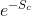
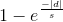
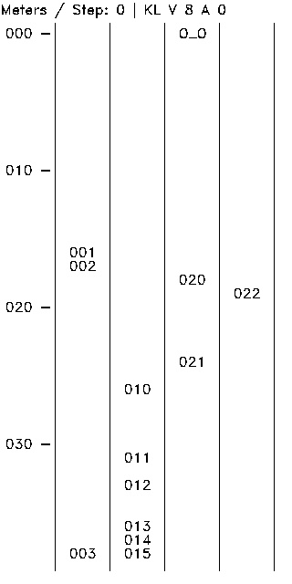

# BehaviorPlanner
Udacity Self Driving Car Behavior Planner

## Overview
Highway lane change behavior planner using finite state machine and cost functions. The FSM includes 5 states:
  - "KL" - Keep Lane  
    The vehicle will attempt to drive its target speed, unless there is traffic in front of it, in which case it will slow down.

  - "LCL" or "LCR" - Lane Change Left / Right  
    The vehicle will IMMEDIATELY change lanes and then follow longitudinal behavior for the "KL" state in the new lane.

  - "PLCL" or "PLCR" - Prepare for Lane Change Left / Right  
    The vehicle will find the nearest vehicle in the adjacent lane which is BEHIND itself and will adjust speed to try to get behind that vehicle.
    
Two cost functions are used for state transition:

    
  

where,  

    Sc is the collision distance  
    s is the distance to the goal distance  
    d is the distance to the goal lane  
  
Here's the result for one scenario.  
    
  
## Build

```
mkdir build
cd build
cmake ..
make
```

## Run

```
cd build
./BehaviorPlanner
```

The program generates images for each step under *build/images*, you could use the following command to see the result immediately:

```
cd build
./BehaviorPlanner && eog images/step_000.jpg
```

Or use the python script to generate a gif:
```
cd build
./BehaviorPlanner && python ../src/make_gif.py && eog images.gif
```
